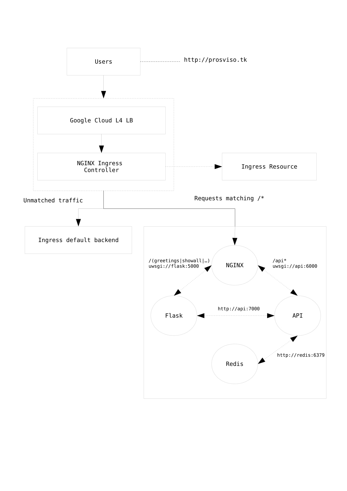

### Studenti

* Luca Brena, matricola: 808216
* Federico Belotti, matricola: 808708

### Descrizione progetto

Il progetto consiste in un'applicazione web distribuita in cui, dato uno username, questa mostra quante volte tale username ha visitato la pagina.
Vengono inoltre messe a disposizione delle semplici API per gestire le risorse.

### Tecnologie utilizzate

* Containerization: Docker
* Provisioning: Kubernetes
* CI/CD: Gitlab

### Struttura progetto

L'applicazione è costituita principalmente da quattro diversi componenti:

* Un proxy reverse Nginx
* Un web server UWSGI dove è ospitata una applicazione Flask
* Un web server UWSGI dove sono ospitate le API per la gestione delle risorse
* Un database Redis key-value

Le richieste 
Ognuna di queste componenti è stata realizzata tramite l'utilizzo di Docker, in particolare la corrispondenza componente:container è 1:1.

### Note

Allo stato attuale il provisioning è gestito da `docker-compose`. Per diversificare le tecnologie stiamo sviluppando una versione complementare che utilizza Kubernetes.
