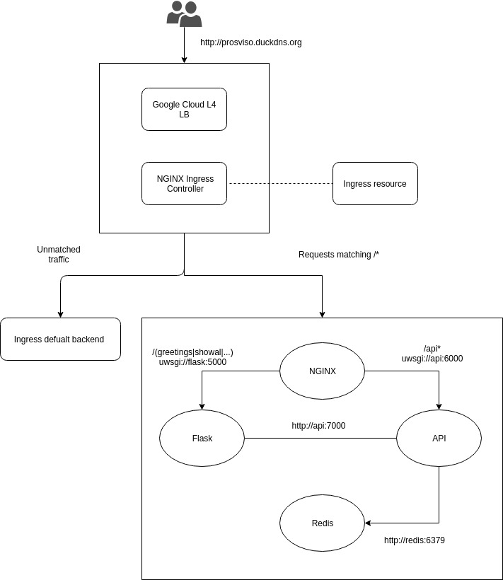

The application is hosted at the IP address http://prosviso.duckdns.org/

### Students

* Luca Brena, matricola: 808216
* Federico Belotti, matricola: 808708

### Project description

The project consists of a distributed web application in which, given a username, this shows how many times that username has visited the page.
They are also made available to the simple API to manage resources.

### Technologies

* Containerization: [Docker](https://docker.com)
* Provisioning: Kubernetes [Kubernetes](https://kubernetes.io)
* CI/CD: [GitLab](https://gitlab.com)

### Struttura progetto

The application is hosted on a Kubernetes cluster in production on Google Cloud.
Client requests at the IP address http://prosviso.duckdns.org/ are taken over by Ingress, the default load balancer of Kubernetes, which deals with exposing the services offered by the cluster to the client.
The application consists mainly of four different components:

* A reverse proxy NGINX
* An UWSGI web server where a Flask application is hosted
* An UWSGI web server hosting resource management APIs
* A Redis key-value database

Ingress forwards the request to NGINX, which redirects it to the correct component.
In particular:

* All / api / * requests will be redirected to the UWSGI web server hosting the APIs
* All requests of type / (greetings | showall | ...) will be redirected to the UWSGI web server on which the Flask web app is hosted
* All requests for static files (html, javascript, css, ...) are directly provided by NGINX
* All requests that do not correspond to any of the previous ones are managed by the Ingress default backend (40x, 50x, ...)

Information about users (username and #visite) is stored in Redis, a key-value database that communicates directly and exclusively with the API.
The APIs, as well as being reachable by the client through NGINX, can be contacted directly by the Flask application without going through the reverse proxy, improving the overall performance.

### Repository branch

The repository is divided into two different branches:

* Kubernetes: deployment branch
* Development: development branch

### GitLab CI/CD pipeline

The GitLab pipeline for the CI / CD is divided into 5 stages:

* Build: the image building is tested. If the stage is successful, images are pushed to the GitLab registry with the tag: $ CI_COMMIT_SHA
* Test: the APIs are tested
* Push: images from the tag: $ CI_COMMIT_SHA are renamed with the tag: test and saved on the GitLab registry, indicating that they have passed the previous tests
* Release: the images are renamed with the tag: latest and uploaded to the registry
* Deploy: if all stages are successfully executed images from the tag: $ CI_COMMIT_SHA are used to update the containers running on the Kubernetes cluster

Where $ CI_COMMIT_SHA indicates the commit revision (GitLab variables).
The Release and Deploy stages are executed only when a commit or request of a merge operation is performed on the Kubernetes branch.

### Sviluppi futuri

Possible future developments are:

* Manage HTTPS requests
* Provide a real sign up / in process through the use of JWT, thus differentiating the general users from the admin users and the related functions associated with them
* Provide to register a domain associated with the application IP address

