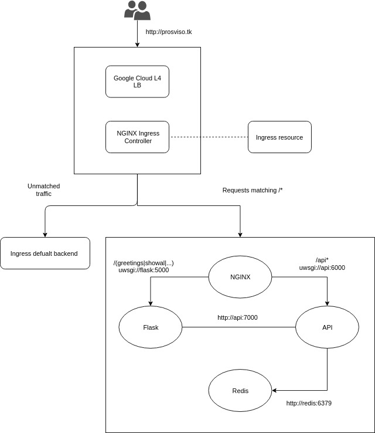

L'applicazione è ospitata all'indirizzo IP http://prosviso.duckdns.org/

### Studenti

* Luca Brena, matricola: 808216
* Federico Belotti, matricola: 808708

### Descrizione progetto

Il progetto consiste in un'applicazione web distribuita in cui, dato uno username, questa mostra quante volte tale username ha visitato la pagina.
Vengono inoltre messe a disposizione delle semplici API per gestire le risorse.

### Tecnologie utilizzate

* Containerization: [Docker](https://docker.com)
* Provisioning: Kubernetes [Kubernetes](https://kubernetes.io)
* CI/CD: [GitLab](https://gitlab.com)

### Struttura progetto

    

L'applicazione è ospitata su un cluster Kubernetes in produzione su Google Cloud.
Le richieste del client all'indirizzo IP http://35.242.237.255 vengono prese in carico da Ingress, il load balancer predefinito di Kubernetes, che si occupa di esporre i servizi offerti dal cluster al client.
L'applicazione è costituita principalmente da quattro diversi componenti:

* Un proxy reverse NGINX
* Un web server UWSGI dove è ospitata una applicazione Flask
* Un web server UWSGI dove sono ospitate le API per la gestione delle risorse
* Un database Redis key-value

Ingress inoltra la richiesta a NGINX, che la ridireziona al componente corretto.
In particolare:

* Tutte le richieste del tipo /api/* verranno redirezionate al web server UWSGI su cui sono ospitate le API
* Tutte le richieste del tipo /(greetings|showall|...) verranno redirezionate al web server UWSGI su cui è ospitata la web app Flask
* Tutte le richieste di file statici (html, javascript, css, ...) vengono direttamente forniti da NGINX
* Tutte le richieste che non corrispondono a nesuna delle precedenti vengono gestite dall'Ingress default backend (40x, 50x, ...)

Le informazioni inerenti agli utenti (username e #visite) vengono memorizzate all'interno di Redis, un database key-value che comunica direttamente ed esclusivamente con le API.
Le API, oltre che essere raggiungibili dal client tramite NGINX, possono essere contattate direttamente dall'applicazione Flask senza passare dal proxy reverse, migliorando le prestazioni complessive.

### Repository branch

Il repository è suddiviso in due differenti branch:

* Kubernetes: branch di deployment
* Development: branch di development

### GitLab CI/CD pipeline

La pipeline di GitLab per il CI/CD è suddivisa in 5 stage:

* Build: viene testato il building delle immagini. Se lo stage ha successo viene eseguita la push delle immagini sul registry GitLab con il tag :$CI_COMMIT_SHA
* Test: vengono testate le API
* Push: le immagini dal tag :$CI_COMMIT_SHA vengono rinominate con il tag :test e salvate sul registry GitLab, ad indicare che hanno superato i test precedenti
* Release: le immagini vengono rinominate con il tag :latest e caricate sul registry
* Deploy: se tutti gli stage vengono eseguiti con successo le immagini dal tag :$CI_COMMIT_SHA vengono utilizzate per aggiornare i container in esecuzione sul cluster Kubernetes

Dove $CI_COMMIT_SHA sta ad indicare il commit revision ([GitLab variables](https://docs.gitlab.com/ee/ci/variables/#predefined-variables-environment-variables)). 
Gli stage di Release e Deploy vengono eseguiti solo ed esclusivamente quando viene effettuata una commit o richiesta di un'operazione di merge sul branch Kubernetes.

### Sviluppi futuri

I possibili sviluppi futuri sono:

* Gestire le richieste HTTPS
* Prevedere un vero e proprio processo di sign up/in mediante l'utilizzo di [JWT](https://jwt.io/), differenziando dunque gli utenti generici dagli utenti admin e le relative funzioni ad essi associate
* Provvedere a registare un dominio associato all'indirizzo IP dell'applicazione

